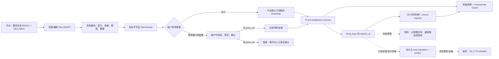

# 套餐管理全流程闭环验证报告

> 核验日期：2026-09-28。范围是当前工作区的契约、实现、任务台账和可重复的非破坏性单元测试；没有把计划文档、页面文案或历史验证回执当作本次生产运行证明。任务完成状态以 `docs/commercial-entitlements/tasks.json` 为准。

## 1. 结论

**当前不能宣称套餐管理已经实现“创建—租户自助开通—多轮到期提醒—到期关停”的完整业务闭环。**

平台侧的套餐版本创建、条款校验、发布、停售和基于固定天数的权益到期失效已经具备可信实现；过期的 `PLAN` 权益来源会在服务端 DB 时钟达到 `expires_at` 后失效，业务 Guard 因而拒绝相应能力。租户也已有“读当前订阅/权益/用量”和“列目标—预览—确认—回读”的代码路径。

但租户自助路线的独立交付任务 CE-15 仍是 `PLANNED`，其前置 CE-14 也是 `PLANNED`；恢复/对账/运营处置 CE-17 同样 `PLANNED`。更关键的是，当前没有套餐到期提醒的领域契约、时间任务、消息路由、收件人解析或验收证据。带 `price_ref` 的套餐不能由租户自行确认，初始租户套餐也由平台默认订阅规则决定，而非租户在开户时选择。因此只能认定为“部分能力可用，尚未全链路验收”。

## 2. 已核验的闭环图谱



### 2.1 节点状态

| 节点 | 状态 | 已核验行为与约束 | 主要证据 |
| --- | --- | --- | --- |
| 模块可售性与套餐草稿 | 已实现 | 只有目录存在、技术 `ready`、销售 `sellable`、销售范围匹配的模块能进入条款；模块/能力/额度/字段重复和依赖不闭合均拒绝。 | `internal/commercial/domain/plan/model.go:104-172`；`contracts/proto/commercial/v1/plan.proto:102-120` |
| 周期和权益配置 | 已实现 | `PlanTerms` 可表达模块、能力、额度、字段、销售范围以及 `unlimited` 或 `fixed_days(1..36500)`；并非按自然月隐式续期。 | `contracts/proto/commercial/v1/plan.proto:8-18`；`internal/commercial/domain/plan/model.go:111-117` |
| 发布、不可变版本与停售 | 已实现 | 草稿可更新；发布后内容不可改，只能 clone 新版；停售保留历史版本。创建/编辑与发布权限分离。 | `internal/commercial/application/planmanagement/internal/usecase/service.go:133-202`；`contracts/proto/commercial/v1/plan.proto:102-136` |
| 平台管理页面 | 已实现（以 API 代码与 CE-13 为限） | 平台页面调用创建、编辑、发布、停售、资格检查 API；已有可信 Web session 的平台生命周期 E2E。 | `web/src/features/platform/pages/CommercialPlansView.vue:1-260`；`web/tests/ce13-platform/ce13-platform-commercial.spec.ts:172-407` |
| 新租户初始套餐 | 部分实现 | 新租户由平台拥有的默认订阅规则匹配并 bootstrap；租户创建请求不能自带套餐选择。这是安全默认开通，并非“租户开户自主选择”。 | `contracts/proto/commercial/v1/subscription.proto:24-48`；`integration/ce08_subscription_mysql_test.go:552-578` |
| 租户读取有效期、状态与权益 | 已实现（读路径） | `/v1/tenant/subscription`、`/v1/tenant/entitlements`、`/v1/tenant/usage` 使用可信租户会话；页面展示周期、状态、权益和用量。 | `contracts/proto/commercial/v1/subscription.proto:49-58`；`web/src/services/enterprise/planRuntime.ts:42-104`；`web/src/features/enterprise/pages/PlansView.vue:84-225` |
| 租户选择、预览、确认、回读 | 部分实现，未验收 | 契约和前端 service 已有 switch/renew/stop-renewal、预览 hash、幂等键及 receipt 回读；server 从 principal 取得租户，不信任客户端 tenant_id。惟 CE-15 和 CE-14 仍为 `PLANNED`，本仓库没有 `TestCE15` 真实 API/E2E 证据，不能按完成路径验收。 | `contracts/proto/commercial/v1/subscription_change.proto:34-57`；`internal/commercial/application/subscriptionchanges/internal/usecase/selfservice.go:17-124`；`web/src/services/enterprise/planChangeRuntime.ts:42-103`；`docs/commercial-entitlements/tasks.json:343-382` |
| 收费套餐的租户确认 | 缺失 | 自助确认若 `pricing_basis != NO_PRICE_REFERENCE` 会返回“需外部审批”；`price_ref` 是不透明引用，不是付款/账务凭证。没有支付或租户到平台审批完成的闭环。 | `internal/commercial/application/subscriptionchanges/internal/usecase/confirm.go:85-88`；`web/src/services/enterprise/planChangeRuntime.ts:106-123`；`docs/commercial-entitlements/routes/R5-automation.md:19-27` |
| 立即/预约变更的权益生效 | 已实现（后端） | 立即变更原子写订阅、来源、快照和回执；预约仅保留 pending change，达到时点由 durable transition 重验并应用。 | `internal/commercial/application/subscriptionchanges/internal/usecase/confirm.go:134-180`；`internal/commercial/application/subscriptionchanges/internal/usecase/time_transition.go:115-135`；`internal/commercial/infrastructure/persistence/timetransition_factories.go:65-96` |
| 到期时关闭套餐权益 | 已实现（强制控制），订阅状态依赖 worker | 固定期限为每个 PLAN source 写 `ExpiresAt`；source 在终点（不包含）立即是 `expired`。Guard 通过权威快照按 DB 时间解析，因而不依赖浏览器或用户登录。Worker 还会推进订阅为 `GRACE`/`RESTRICTED`/`ENDED` 并保留 transition 审计；若 worker 未部署，权益仍会过期拒绝，但订阅状态可能不及时转移。只撤销套餐来源的贡献，仍有效的 addon/override 可能继续授予权益。 | `internal/commercial/domain/subscription/materialize.go:26-57`；`internal/commercial/domain/entitlement/model.go:69-81`；`internal/commercial/infrastructure/persistence/entitlement_snapshot.go:89-166`；`internal/commercial/application/subscriptionchanges/internal/usecase/time_transition.go:185-251`；`internal/bizruntime/provisioning_worker.go:102-146` |
| 到期前多轮预警 | 缺失 | 未发现针对 subscription/plan expiry 的 reminder/warning 事件、策略、时间 transition、收件人路由、通知投递或测试。`biz_commercial_subscription_notifications` 仅是订阅事件投影表，不是面向用户的到期提醒通道。 | `internal/commercial/domain/timetransition/model.go:15-25`（仅三类 transition）；`internal/commercial/infrastructure/persistence/provisioningmigrations/0001_provisioning.sql:75-83`；`internal/commercial/infrastructure/persistence/outbox.go:1-220` |
| 失败恢复、对账和运营处置 | 缺失 | CE-17 尚未交付；没有将卡住的自助变更、worker 故障、提醒投递失败和订阅/权益漂移统一暴露、重试、补偿和告警的完成能力。 | `docs/commercial-entitlements/tasks.json:406-424`；`docs/commercial-entitlements/routes/R5-automation.md:53-65` |

## 3. 数据流和触发条件核验

### 3.1 平台创建与发布

1. 平台主体必须处于无 tenant 的平台上下文；创建/编辑需要 `platform.plan.manage + commercial.catalog.read`，发布/停售需要独立的 `platform.plan.publish + commercial.catalog.read`。见 `contracts/proto/commercial/v1/plan.proto:102-120`。
2. 保存和发布均重新调用 `Terms.Validate`；它检查周期模式、目录技术/销售状态、scope、能力、字段安全下限以及模块/能力依赖。见 `internal/commercial/application/planmanagement/internal/usecase/service.go:151-184` 与 `internal/commercial/domain/plan/model.go:104-172`。
3. 成功发布后订阅只绑定确定的 `(plan_code, version)`，新版不会隐式替换旧订阅；这是版本兼容的正确基础，但“批量迁移租户到新版”的产品流程不在本次已完成范围。

### 3.2 租户查看与自助变更

1. 查看接口只从可信会话的 active tenant 读取，前端还核验 API 回传 tenant 与当前会话一致。见 `web/src/services/enterprise/planRuntime.ts:28-104`。
2. 自助请求没有 `tenant_id`；服务端从 principal 固定 tenant。目标列表按当前订阅的 sales scope 过滤，预览绑定当前订阅、快照、目录与套餐内容摘要，确认会重验且以 request/preview hash 防重放。见 `internal/commercial/application/subscriptionchanges/internal/usecase/selfservice.go:17-124`、`internal/commercial/application/subscriptionchanges/internal/usecase/confirm.go:35-126`。
3. 自助确认只允许没有价格引用的变更；带价格引用不会被前端或后端伪装为已付款，而是阻断为外部人工商业确认。故“任意适配套餐均可租户自主完成开通”的条件不成立。

### 3.3 到期与关停

1. `fixed_days` 在生效时间上加天数，并将同一到期时间写入每个套餐权益来源；见 `internal/commercial/domain/subscription/materialize.go:43-51`。
2. 权益 source 在 `at >= ExpiresAt` 时状态为 `expired`，Resolver/快照使用数据库 UTC 时间重算；已过期能力不再成为 `Allowed`。见 `internal/commercial/domain/entitlement/model.go:69-81`、`internal/commercial/infrastructure/persistence/entitlement_snapshot.go:104-166`、`internal/commercial/enforcement/guard.go:187-221`。
3. 同时会为有限订阅持久化 `SUBSCRIPTION_BOUNDARY`，worker 以租约领取并以版本围栏完成。零宽限期转 `RESTRICTED`，停止续期转 `ENDED`，有配置的 grace 只在权威边界内生效；延迟领取不能延长已到期权益。见 `internal/commercial/infrastructure/persistence/timetransition_factories.go:43-96`、`internal/commercial/application/subscriptionchanges/internal/usecase/time_transition.go:185-251`。
4. 这是一条“套餐来源过期即拒绝”的权限关闭链，而不是全租户一刀切的停用：Resolver 合并所有仍 active 的来源，Guard 不读取 subscription state。因此 standalone addon/override 仍可授予其自身有效期内的能力；如果产品要求套餐到期后关闭租户的一切功能，需要新增 subscription-state 优先拒绝或 Tenant.Suspend gate。见 `internal/commercial/domain/entitlement/resolve.go:53-109`、`internal/commercial/enforcement/guard.go:189-229`。
5. 这也不是一条“先通知、再确认、再关停”的客户沟通链；后者当前不存在。

## 4. 断点与逻辑漏洞清单

| 优先级 | 断点/风险 | 影响 | 处置要求 |
| --- | --- | --- | --- |
| P0 | 无到期前多轮预警的领域模型和执行链 | 无法满足到期前多轮提醒；租户可能仅在功能被拒绝后才知道到期。 | 新建 reminder policy（提前天数、去重、时区、收件人、渠道、模板）、持久化提醒任务、outbox/notification routing、投递回执与失败告警；覆盖每个提醒窗口、重复 worker、续期/换套餐取消旧提醒。 |
| P0 | CE-15/CE-14/CE-17 均未完成 | 虽有自助相关源码，缺少任务权威完成状态及 `TestCE15` 端到端证明；失败/卡住状态没有可运营闭环。 | 先完成 CE-14，再以 CE-15 补真实 API/E2E；完成 CE-17 的对账、重试、补偿、告警和权限控制，之后才可写“自助闭环”。 |
| P0 | 收费套餐自助不能完成 | `price_ref` 非空时确认被拒，且无支付或外部审批状态回传；用户不能在系统内完成收费套餐开通。 | 明确产品边界：仅免费套餐自助；或交付带审计的报价/订单/支付/平台审批回执，且只由服务端把已核验商业事实转为确认。 |
| P1 | 新租户首购不由租户选择 | 开户时仅匹配平台默认规则，不能满足“租户自主选择适配套餐后开通”的首购体验。 | 增加受控首购候选与确认路线，或在产品规范明确首购由平台配置、租户仅在创建后变更；不能让 tenant create 接受任意 plan code。 |
| P1 | worker 的实际部署与健康监控未被本次运行验证 | DB 时间已经保证权益不会因停 worker 而延长，但 `GRACE/RESTRICTED/ENDED` 状态、transition 审计、预约执行和后续运营依赖自动 worker。 | 在目标环境用 persisted platform credential 启用 `Automatic=true`，监控 `commercial-provisioning-worker` health、transition backlog/lease/失败；按共享 MySQL 流程补运行证据。 |
| P1 | worker 默认并不保证自动轮询 | 只有配置 `YUNKA_BIZ_PROVISIONING_WORKER_TOKEN` 才会注册自动 worker；缺失时 subscription boundary 不被消费，订阅读模型不会自动同步到 `RESTRICTED/ENDED`。 | 将 worker token、健康检查和 backlog 告警作为目标环境发布前置条件，演练失联、租约接管和恢复。证据：`cmd/biz/main.go:139-149`；`internal/bizruntime/runtime.go:175-178`；`internal/bizruntime/provisioning_worker.go:119-146`。 |
| P1 | “到期与宽限”平台页面不构成真实状态证明 | 页面使用静态流程/提醒文案，不读取 transition 或提醒服务；可能让运营人员误以为已进入提醒窗口。 | 在 CE-17 交付真实 transition、提醒和回执读模型前，将其标识为 preview，或移除会被理解为事实的状态。证据：`web/src/features/platform/platformLifecycle.ts:33,57-76,204-222`。 |
| P1 | 提醒/到期的租户页面仅展示当前日期，无专门到期风险态 | 读页面有 `periodEnd`，但没有“距到期 N 天”、提醒历史、续费/人工确认待办或明确恢复入口。 | 在 CE-15/17 的真实 server-backed 页面接入 reminder/readback 状态；demo 路径必须继续明确为非真实开通。 |

## 5. 验证记录与覆盖边界

本次执行的非破坏性验证：

```text
go test ./internal/commercial/domain/... ./internal/commercial/application/planmanagement/... ./internal/commercial/application/subscriptionchanges/... ./internal/commercial/enforcement ./internal/bizruntime
# PASS；其中 planmanagement/internal/usecase 和 subscriptionchanges/internal/usecase 报告 [no test files]

python3 docs/commercial-entitlements/tools/check_plan.py
# PASS（仅计划文档结构，不认证产品行为）

git diff --check
# PASS
```

已有的强相关主仓库证据包括：`integration/ce08_authority_mysql_test.go:131-190`（fixed-days source expiry）、`integration/ce06_snapshot_mysql_test.go:188-242`（无 scheduler 时的时间边界）、`integration/ce16_lifecycle_mysql_test.go:112-350`（transition、宽限、延迟和并发 worker）及 `docs/commercial-entitlements/evidence/CE-16.md:15-44`（当时的真实 MySQL 回执）。这些证据支持后端到期控制的设计和历史资格，不替代本次共享数据库的重新运行。

本次没有重置或写入共享 MySQL。按照 `docs/evolution/LOCAL-DATABASE.md` 与项目根 `AGENTS.md`，完整运行验证必须先停止应用访问、显式启用 fixture reset、备份并由 `scripts/qualify-evolution-mysql.py` 恢复数据。现有代码还缺少提醒和 CE-15/17 交付，故即使现在运行 CE-16，也不能把结果升级为完整套餐闭环通过。

## 6. 最终判定

| 判定项 | 结果 |
| --- | --- |
| 平台管理员：可配置期限/权益并发布套餐 | **通过（实现级）** |
| 租户：可查看当前套餐、有效期和已开通权益 | **通过（读路径实现级）** |
| 租户：自主完成所有套餐的选择与开通 | **不通过**：仅有未验收的自助路径，且收费套餐需外部平台确认，首购为平台默认规则。 |
| 到期：套餐内权益自动关闭 | **通过（后端强制控制实现级）**：PLAN source expiry + DB 时间 + Guard；订阅状态转移需 worker 运行。独立 addon/override 仍按其自身来源继续生效。 |
| 到期前多轮提醒 | **不通过**：当前无实现或验收证据。 |
| 全链路顺畅、可运营、可合规闭环 | **不通过**：须先补齐 P0/P1 断点并完成 CE-15、CE-17 及真实 MySQL/API/E2E 验收。 |
