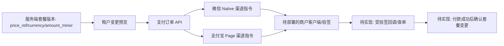

# 租户套餐支付渠道适配验证报告

日期：2026-09-29。

本报告覆盖当前可交付范围：套餐价格事实、租户支付订单、微信 Native 与支付宝 Page 渠道接口适配。它不声明已配置商户凭证、已完成真实支付或已在供应商沙箱完成扣款。

## 已实现并通过的验证

| 验证项 | 结果 | 证据 |
| --- | --- | --- |
| 套餐价格事实 | 通过 | `internal/commercial/domain/plan/model_test.go`：收费套餐的币种和最小货币单位金额必须成对、合法；套餐内容哈希包含价格。 |
| 订单回调防篡改 | 通过 | `internal/commercial/domain/payment/model_test.go`：订单固定绑定租户、变更、套餐、价格、币种与渠道；渠道/金额/币种/交易号不符拒绝，精确重复安全重放。 |
| 渠道适配 | 通过 | `internal/commercial/paymentchannel/channel_test.go`：微信 Native 仅输出二维码支付指令；支付宝 Page 仅输出跳转支付指令；渠道与订单不匹配拒绝。 |
| 商业契约与安全门禁 | 通过 | `go test ./internal/architecture`：支付订单 API 不接受客户端金额、币种、套餐代码或版本；仅受控租户 Web 会话可访问。 |
| 全仓库 Go 回归 | 通过 | `go test ./...`：2026-09-29 通过。 |

## 已实现数据流

## 未覆盖和不应宣称的能力

1. 没有商户号、证书/密钥引用、支付网关环境或回调域名，故未发送微信/支付宝网络请求，未进行签名、验签、退款或主动查单。
2. 支付成功回调尚未接入套餐确认；当前收费套餐仍 fail closed，订单创建不会开通权益。
3. 共享 MySQL 集成测试未运行。它必须使用 `scripts/qualify-evolution-mysql.py` 的备份、串行重置和恢复流程；不得绕过该流程直接写共享数据库。
4. 浏览器验收未形成结果。受控浏览器运行时不可用；项目 Playwright 的内置 Chromium 不支持本机 macOS 版本，而使用本机 Chrome 的一次运行未输出可用 JSON 回执。因此没有截图或交互通过结论。

## 继续交付的前置条件

部署方需以受控密钥引用提供微信支付与支付宝的商户配置及回调地址。取得后，实施顺序为：渠道客户端发起凭证 → 签名/验签与通知 Inbox → 主动查单对账 → 付款成功后以订单事实驱动套餐确认 → 真实供应商沙箱和共享 MySQL/API/E2E 验收。
