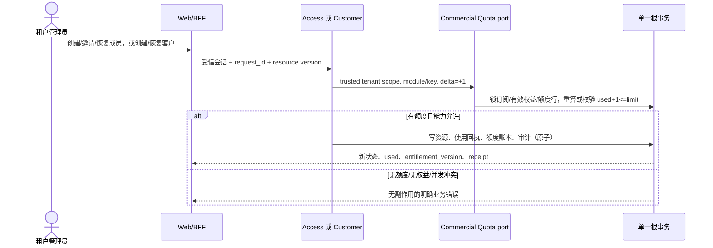
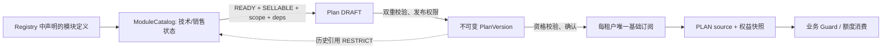

# 租户额度与商业开通功能实现规范

> 状态：设计与实施准入规范。它描述目标行为和改造边界，不把尚未接入的客户后端、客户额度或成员额度消费表述为现状。关联现状见 [关系分析](tenant-module-plan-member-customer-relationship-analysis.md)。

## 1. 决策与边界

### 1.1 权威边界

| 事项 | 唯一写入者/事实源 | 租户管理员能做的事 | 平台管理员能做的事 |
| --- | --- | --- | --- |
| 已购套餐、模块、成员/客户限额 | Commercial 的订阅、权益来源及派生快照 | 查看；按自助套餐变更规则发起申请 | 配置套餐、确认变更、建立受控例外授权 |
| 成员与其状态 | Access 的 membership | 创建、邀请、恢复、暂停、移除（有权限时） | 不越过租户边界直接写成员 |
| 客户与客户计数 | **拟新增 Customer domain** | 创建、归档、恢复、移交客户 | 不直接写租户客户，只配置权益 |
| 模块目录、可售/技术状态 | Commercial ModuleCatalog | 无 | 创建、状态变更、停售；不能任意定义运行时代码能力 |

租户管理员不能把 `tenant.members` 或拟定的 `tenant.customers` 改大；“调整数量”是消费或释放已经生效的额度。要增加上限，只能走套餐变更或由具备 `platform.entitlement.manage` 的平台主体创建受控、可审计的额度例外授权。

### 1.2 必须新增的能力

当前系统只提供成员的权威**计量**，尚未在邀请、创建、恢复前强制额度；客户只有前端 preview/localStorage 数据。因此下列改造是上线前置条件：

1. 新增 Commercial 本地 typed-child `CheckAndConsumeQuota` / `ReleaseQuota`，或等价的单一额度消费端口；不得让 Access/Customer 直接读取 Commercial repository，亦不得用浏览器预检代替提交时校验。
2. 将 `tenant.member.invite`、`tenant.member.create`、`tenant.member.restore` 纳入同一个根 UoW 的额度保留与成员写入；`remove` 在同一 UoW 释放，`suspend` 不释放。
3. 以 `customer-management`、能力 `customer.lifecycle`、额度键 `tenant.customers` 建立真实 Customer domain、迁移、API 与 capability mapping；计量规则采用“非 archived 的客户账户消耗，archived 释放，restore 重新检查”。这个规则是本规范的业务选择，变更前应由产品确认。
4. 为新的客户业务 operation 补齐模块/能力映射和权益 Guard。当前 customer preview 的本地命令不可复用为生产写入端。

## 2. 租户管理员：成员数与客户额度使用流程

### 2.1 页面与交互

在“设置 → 套餐与用量”增加只读额度卡：模块、额度键、`used / limit`、无限标识、计量证据、最后刷新时间、当前权益版本。缺失计量器显示“未知”，绝不显示为 0；无访问权限显示 403 页面而不是隐藏事实。

成员页、新建客户抽屉在打开时可做非绑定预检，提交按钮旁展示预计 `used + 1`。预检通过不保证提交成功；提交时按钮禁用、携带 idempotency key 和资源 `version`，成功后以服务端回读的成员/客户及用量卡更新界面。若达到上限，保留草稿、显示当前用量和“申请扩容/切换套餐”入口，不自动跳转、不开通也不删除现有资源。

### 2.2 后端命令语义与权限

| 命令 | 权限和作用域 | 提交时额度动作 | 成功后的结果 |
| --- | --- | --- | --- |
| 邀请/创建成员 | `tenant.member.manage`；创建/恢复另需既有 `tenant.role.manage`；认证 tenant_required | `access-management/tenant.members +1` | invited/active membership 消耗额度；通知失败必须使整个写入失败或以已有可靠 outbox 处理，不能有未审计半成功 |
| 恢复成员 | `tenant.member.manage` + `tenant.role.manage` | `+1` | 仅资源仍为 removed 时可恢复；失败仍保持 removed |
| 暂停成员 | `tenant.member.manage` 且通过最后 owner 约束 | 0 | suspended 仍消耗额度 |
| 移除成员 | `tenant.member.manage` 且通过最后 owner 约束 | `-1` | 仅提交成功后释放；重复请求按回执重放，不能二次扣减 |
| 新建/恢复客户（新增 API） | `tenant.customer.manage`，tenant_required | `customer-management/tenant.customers +1` | 非 archived 账户消耗；客户名唯一性与 owner/scope 校验仍先于或同事务完成 |
| 归档客户（新增 API） | `tenant.customer.manage` | `-1` | 仅所有归档前业务阻塞条件满足才释放；历史不删除 |
| 查询用量 | `tenant.entitlement.read` | 无 | 只从可信 tenant principal 取 scope，不接收 tenant_id |

“先校验权限，后校验能力/额度，再写资源”的顺序是对外语义；实现上所有可见变更、一次性回执和审计都必须在同一个根 UoW 提交。读取有效额度时还须确认模块能力为 allowed；`unlimited=true,value=0` 是无限，`unlimited=false,value=0` 是零额度。安全 deny、技术 disabled、依赖不可用、额度配置冲突、过期/撤销来源均 fail closed。

### 2.3 防超限与并发模型

额度不能靠“先 Count、再 INSERT”的两个事务实现。消费端口须按固定顺序锁定：目录 epoch（共享）→ 租户基础订阅/权益状态 → `(tenant,module,key)` 额度状态行 → 被写资源或租户 membership 集合。首次使用可用唯一键插入额度状态行；随后以 `FOR UPDATE` 读取。以权威资源计数校准账本（迁移期）或由不可变消费记录维护 `used`，但二者只能有一个权威写模型。

每次 `+1` 在锁内计算 `next_used`；有限额度仅当 `next_used <= value` 时允许。发生死锁或短暂锁错误时，重试整个根请求，绝不在半个事务中重试 SQL。idempotency 指纹绑定 actor、operation、tenant、目标和完整载荷；同键异载荷返回冲突。CAS 不匹配返回 `ABORTED/409` 并给出可回读的最新版本，不能用旧表单覆盖。

建议对外错误码：`QUOTA_EXCEEDED`（409，含 key/used/limit，不泄露其他租户信息）、`ENTITLEMENT_DENIED`（403）、`QUOTA_METER_UNKNOWN`（503，禁止默认 0）、`VERSION_CONFLICT`（409）、`LAST_OWNER_PROTECTED`（409）、`IDEMPOTENCY_CONFLICT`（409）和 `DEPENDENCY_UNAVAILABLE`（409/503，按技术状态映射）。超时、取消、存储不可用不应写成功提示；客户端保留草稿并允许用同一 key 安全重试。

### 2.4 审计与合规留痕

每次尝试均追加防篡改审计；成功与拒绝均保留，敏感字段使用 request digest/脱敏前后摘要而非凭据或完整 PII。最低字段为：audit/event ID、发生时间、tenant/resource tenant、actor subject/user、认证方法与 session ref、operation、目标资源、模块/额度键、delta、`used_before/after`、`limit` 和权益版本、request/idempotency/trace ID、reason、结果/拒绝原因、回执引用与前后资源版本。复用 `TenantAuditRecordDTO` 的可查询字段，并为商业额度写入对应 commercial audit/outbox 事实。

审计与资源/额度变更同事务提交；审计失败必须回滚业务写入。租户审计查询要求 `tenant.audit.read`，导出要求 `tenant.audit.export`；平台跨租户解释遵循已有平台权限，不能借助租户 API 越权读取。

## 3. 平台管理员：模块开通、套餐新建与绑定

### 3.1 模块和套餐配置流程

1. 平台主体以可信无 tenant 身份登录。创建模块需要 `platform.module.manage`；模块代码必须已在服务端 `Registry` 声明，能力/额度键/字段键并非表单可自由添加。
2. 模块初始状态为 `NOT_READY`（若已声明实现则可为 `READY`）、`SELLABLE`；技术设为 READY 需要 `platform.module.technical.manage` 且实现已就绪。销售范围、依赖和版本以目录为准。
3. 套餐编辑人以 `platform.plan.manage + commercial.catalog.read` 创建首个 DRAFT 或从已发布/停售版 clone；在草稿中选择模块并配置其声明过的 capability、quota、field policy。
4. 服务端在保存和发布两次校验：模块技术 READY、可销售、销售范围不被套餐扩大、依赖闭合、无重复 module/capability/quota/field、额度合法、字段安全底线、`device.transfer → device.lifecycle` 等能力依赖。
5. 发布人另需 `platform.plan.publish`。发布将内容 SHA-256 固化为 `PUBLISHED`；后续修正只能 clone 新版本。停售为 `RETIRED`，不删除历史。
6. 平台为租户“开通模块”的正常路径是把已发布套餐版本作为唯一基础订阅切换目标，或创建有期限、原因和审计的 entitlement override；不得新增一条无套餐/来源/快照的“租户模块开关”旁路。

### 3.2 生效时间、同步与状态机

| 情形 | 订阅/权益状态 | 何时对业务 Guard 生效 | 同步要求 |
| --- | --- | --- | --- |
| 无外部准备的立即套餐变更 | `APPLIED` | 确认根事务内的最后 DB 时间准入后 | 同事务更新 subscription、PLAN sources、快照、回执、审计和 outbox |
| 需要外部准备 | `PROVISIONING`，有 pending change | 所有版本化步骤 READY 且最终重校验通过后 | worker 租约+幂等键+对账；旧权益保持到激活 |
| 预约/降级 | `SCHEDULED` + pending | 预约时刻的执行器重校验成功后 | 预约不是提前开通；过期/超额/目录变更失败关闭 |
| 套餐停售 | 旧订阅不变 | 不撤销旧来源；阻止新申请 | 目录/套餐列表反映停售，快照仍能解释历史 |
| 模块技术 disabled | 订阅记录可保留 | resolver/Guard 即时拒绝 | 生成可审计故障/运营告警，不把 disabled 当作删除历史 |

Outbox 是不可变业务事实，消费者以 `(consumer_id,event_id)` 去重，只接受更大的 aggregate revision；旧乱序事件记录 STALE，失败保留并有限重试，绝不通过前端轮询伪造成功。控制台只展示确认后的回读（subscription revision、source/entitlement version、task/outbox 状态）；配置保存成功不等于租户权益已生效。

### 3.3 套餐版本兼容性规则

- `plan_code` 稳定，`version` 单调递增；PUBLISHED/RETIRED 内容不可修改、不可硬删，数据库的计划-模块引用使用 RESTRICT。
- 租户订阅显式钉住 `(plan_code, version)`；发布 v2 不会自动改变使用 v1 的租户，也不会因新 capability 自动扩大旧套餐。
- 降额、能力/字段减少、期限收缩或混合增减一律按 DOWNGRADE，默认在当前有限期限结束时生效；无限期来源必须提交明确未来时间。执行时重算真实用量，未知或超限不得立即降额。
- 迁移 v1→v2 必须重新 preview + confirm，快照/目录/套餐内容摘要/权限版本有任一变化即冲突；不可回写历史来源。纠错以新的补偿变更完成。
- 模块删除只在没有依赖或计划引用时允许；代码进入 retired set 后不可复用。已发布套餐引用的模块只能停售或技术停用，不能删除。

## 4. 交付拆分、契约与验收

### 4.1 推荐实现顺序

1. 为 Customer domain 取得产品确认（客户的计费状态、归档释放规则、所有者移交约束），随后实现 schema、API、模块映射和租户隔离测试。
2. 实现跨域 typed-child 的原子额度消费端口及消费记录/状态迁移；先改 Access 的 invite/create/restore/remove，再接 Customer。
3. 增加可信用量 API（成员沿用 `/v1/tenant/usage`，客户加入同一响应）；前端仅通过 typed service/BFF 调用并展示未知状态。
4. 接入平台模块/套餐控制台到现有可信会话和真实 API；不要让当前 demo 页面产生虚假的商业写成功。
5. 完成生产前迁移、并发、故障恢复和审计导出资格；迁移为 additive，部署顺序为迁移→二进制→worker，禁止回拨版本或删除历史回执。

### 4.2 测试矩阵（新增实现的完成门槛）

| 层级 | 必测场景 | 关键断言 |
| --- | --- | --- |
| Domain unit | unlimited/0/有限边界、+1/-1、重复回执、过期来源、安全 deny、模块依赖 | never overflow、never default unknown to zero、同键同载荷稳定、同键异载荷冲突 |
| Access/Customer application unit | invite/create/restore 到达上限；remove/archive 释放；suspend 不释放；最后 owner；跨租户 | 失败无 membership/customer/ledger/audit success 副作用；所有 scope 来自 principal |
| Commercial unit | DRAFT→PUBLISHED→RETIRED、克隆、范围、模块依赖、额度/字段校验、版本钉住 | 旧版本不变、新 capability 不回灌、RESTRICT 引用有效 |
| 并发集成 | 两个 `+1` 竞争最后一个名额；create 与 archive；提交重试；套餐降额与创建竞争 | 至多一个成功；计数/账本/资源/审计一致；无死锁泄漏 |
| 生命周期集成 | immediate、scheduled、provisioning、worker 崩溃/租约接管、outbox 重投乱序 | 权益只在定义时点生效；旧 worker 不能覆盖；事件恰好按版本前进 |
| HTTP/E2E | tenant/platform 权限矩阵、403/409/503、草稿保留、回读刷新、审计查询/导出 | 浏览器不含 API key；无假成功、无其他租户数据、错误可操作 |

所有 MySQL 集成验证使用项目唯一共享容器及 `scripts/qualify-evolution-mysql.py` 的备份/重置/恢复流程，串行执行；不在普通本地数据库或新的容器中伪造通过。现有验证结果和本次未覆盖范围记录在本文档的执行回执中，而不是将设计测试矩阵误写为已通过。

## 5. 本次基线验证回执（2026-09-28）

- 已通过：`go test ./internal/commercial/domain/... ./internal/commercial/modulecatalog ./internal/commercial/application/subscriptionmanagement/internal/usecase ./internal/access/application`。覆盖套餐/权益/订阅变更领域、模块目录与 Access 应用层；结果全部通过（subscription-management usecase 当前无测试文件）。
- 识别到的既有集成场景：`integration/ec_ri_06_tenant_usage_mysql_test.go` 验证成员用量仅统计非 removed、租户隔离和移除释放。
- 未执行共享 MySQL 集成：资格脚本在任何备份/fixture 重置前检查到其他数据库客户端而拒绝启动。必须先由占用者停止应用/数据库访问，再按本仓库的恢复式流程运行；不能绕过该保护直接执行单个集成测试。
- 未能宣称通过：本规范中新增的成员消费强制、Customer domain/额度、生产前端对接尚未存在于基线，故不存在可运行的实现级测试。这是如实的交付缺口，不是测试失败的替代描述。
