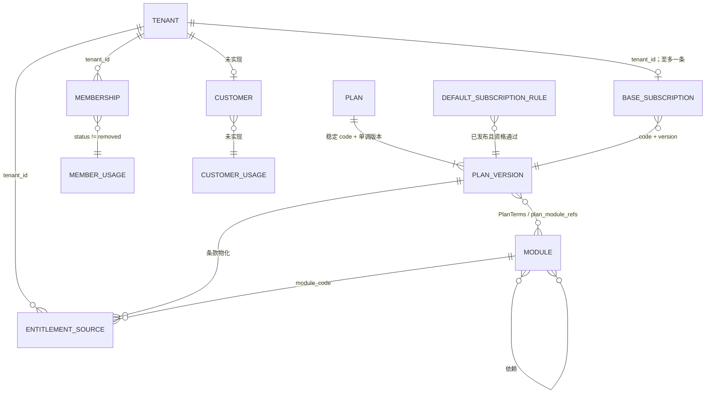

# 租户、模块、套餐、成员与客户额度关系分析（仓库现状）

更新日期：2026-09-28。本报告基于当前仓库的 proto、领域代码、迁移和测试；严格区分已经实现的事实与路线中的待实现项。

## 结论

- 租户与系统模块不是 `tenant_modules` 静态表关系，而是“套餐/例外来源 → 权益解析”的间接多对多。模块能力最终由当前、同租户的权益来源、技术状态、明确拒绝和模块依赖共同决定。
- 套餐版本内嵌 `PlanModule`，并通过 `biz_commercial_plan_module_refs` 留下保护历史的多对多引用。它可配置能力、额度和字段策略，但不能引用未就绪、停售、范围不符或依赖不闭合的模块。
- 每个租户至多一条基础订阅，钉住一个 `(plan_code, plan_version)`；启动或变更时把套餐条款物化为 plan entitlement sources，再生成快照。
- 成员额度当前只实现 `access-management / tenant.members` 的可信已用数读取：invited、active、suspended 计入，removed 释放。邀请、创建、恢复目前**未**执行原子额度消费或超限拦截。
- 客户实体、客户额度键、客户用量计量、客户写接口和额度闸门均不存在于后端；前端 Customer 是按租户隔离的 preview/localStorage 数据，不能作为生产额度事实。

## 关系图谱

`MEMBER_USAGE` 是对 memberships 的权威实时计数，不是独立实体；图中 CUSTOMER 相关节点明确表示设计缺口。

| 关联 | 类型、依赖和生效 | 约束 |
| --- | --- | --- |
| 模块 → capability/quota/field schema | 1:N；服务端 Registry 定义 schema，目录只保存状态与版本 | code 唯一；依赖不能缺失/成环；未实现模块不能 READY。当前 `access-management` 声明 `tenant.members`，`device-operations` 声明 `tenant.devices`。|
| 模块 → 模块 | 自引用 N:N 依赖 | 创建模块时依赖必须存在；被依赖模块不能删除；解析时任一依赖不可用即拒绝。|
| 套餐 → 套餐版本 | 1:N | DRAFT 可编辑；PUBLISHED 是不可变历史；RETIRED 只停止新销售。无硬删除/回退。|
| 套餐版本 → 模块 | N:N | 条款至少一个模块；模块、能力、额度键、字段动作不得重复；能力/额度/字段必须属于所选模块，且模块 READY、可销售、范围相容、依赖闭合。|
| 租户 → 基础订阅 → 套餐版本 | Tenant 0..1 → 1 | 默认规则选择已发布且符合 sales scope 的版本；启动写订阅、来源和收据。订阅表以 tenant_id 为主键，防止同时存在两个基础套餐。|
| 租户 → entitlement source → 模块/能力/额度/字段 | Tenant 1:N → 解析结果 | 统一半开时间区间 `[effective_at, expires_at)`；来源可为套餐、附加或受控 override。安全拒绝、技术不可用、显式拒绝、grant、依赖按优先级解析。|
| entitlement source → quota decision | N:1 派生 | `unlimited=true,value=0` 为无限；`unlimited=false,value=0` 为零；replace 覆盖基础和 add；相同专项 replace 时间窗不能重叠；溢出和冲突 fail closed。|
| 租户 → membership → 成员用量 | Tenant 1:N → 派生计数 | scope 只取可信 principal；未 removed 的 invited/active/suspended 消耗，removed 释放。它目前是读模型，不是创建/恢复时的配额锁。|
| 租户 → customer → 客户用量 | **未实现** | 尚无可信客户 ID、租户归属、生命周期、计量口径、额度键或后端写路径；禁止把 absence 当 0。|

## 约束、权限与审计边界

### 模块、套餐、开通

1. 模块技术状态与销售状态独立：停售阻止新套餐/新申请，但不撤销现有来源；技术非 READY 会让解析/Guard 拒绝。
2. 套餐写入必须带 request ID、reason、预期 revision；同载荷重放收据，revision 不匹配拒绝。保存、发布、资格检查均重新读取目录，并在 catalog admission lock 下运行。
3. 平台套餐作者是无 tenant 的认证主体。创建/编辑/克隆要求 `platform.plan.manage + commercial.catalog.read`；发布/停售要求 `platform.plan.publish + commercial.catalog.read`。
4. 订阅与套餐版本使用 RESTRICT 外键。发布新版本不会自动改变旧租户订阅，也不会因新 capability 自动扩大旧套餐；修正必须 clone 新版本并走新的预览/确认。
5. 平台为租户开通模块的现有可信承载是基础订阅变更或有期限、原因和审计的 entitlement override，不应另造绕开来源/快照的 UI 开关。

### 成员与客户额度

1. `tenant.member.invite` 需要 `tenant.member.manage`；`tenant.member.create` 与 restore 还需要 `tenant.role.manage`；所有为 tenant_required 的可信会话。计量读取需要 `tenant.entitlement.read`。
2. 内部 `CountTenantQuotaMembers` 没有 tenant ID 请求参数，因而不能由调用方伪造其他租户。它在数据库不可用时返回错误，Commercial 映射为 `TENANT_USAGE_AUTHORITY_UNAVAILABLE`，没有伪造的零值。
3. 当前成员写代码没有读取 entitlement limit、QuotaManagement child operation、reserve/commit/release 或配额状态表。CE-18/CE-19 仍为 PLANNED，故不能声称成员上限已强制。
4. Access 的成员审计、Commercial 的模块/套餐/订阅审计均已存在，但尚没有“成员/客户额度消费”原子审计事实。未来消费实现必须把资源、额度、幂等收据和审计在同根 UoW 提交。

## 现有验证与缺口

| 范围 | 一手测试证据 | 已证明/未证明 |
| --- | --- | --- |
| 模块目录 | `internal/commercial/modulecatalog/registry_test.go`；`integration/ce02_module_catalog_mysql_test.go` | 定义图、依赖、技术/销售状态、代码不可复用。|
| 权益解析 | `internal/commercial/domain/entitlement/resolve_test.go` | 租户隔离、优先级、半开时窗、依赖、额度 replace/溢出；未证明业务写入额度消费。|
| 套餐版本 | `internal/commercial/domain/plan/model_test.go`；`integration/ce07_plan_mysql_test.go` | 作者侧校验、不可变版本、停售历史可读。|
| 默认订阅 | `internal/commercial/domain/subscription/ce08_test.go`；`integration/ce08_subscription_mysql_test.go` | 规则选择、条款物化、重放和单基础订阅。|
| 成员用量 | `integration/ec_ri_06_tenant_usage_mysql_test.go` | 非 removed 计入、removed 释放、租户隔离与无权限拒绝；未证明超额 invite/create 会被阻断。|
| 客户额度 | 无 domain/proto/migration/meter/写接口测试 | **没有可执行的客户额度验证。**|

## 源码证据索引

所有以下路径均相对仓库根目录，供实现和评审直接定位：

- 模块 schema/状态/依赖：`internal/commercial/modulecatalog/model.go`、`service.go`、`migrations/0001_module_catalog.sql`、`plan_catalog.go`。
- 套餐契约、校验和持久化：`contracts/proto/commercial/v1/plan.proto`、`internal/commercial/domain/plan/model.go`、`internal/commercial/infrastructure/persistence/planmigrations/0001_plans.sql`。
- 订阅及来源物化：`contracts/proto/commercial/v1/subscription.proto`、`internal/commercial/domain/subscription/{model.go,materialize.go}`、`internal/commercial/application/subscriptionmanagement/internal/usecase/service.go`。
- 权益来源与解析：`contracts/proto/commercial/v1/entitlement.proto`、`internal/commercial/domain/entitlement/{model.go,resolve.go}`、`internal/commercial/infrastructure/persistence/migrations/0001_entitlement_sources.sql`。
- 成员计量与写路径：`contracts/proto/access/v1/tenant_member.proto`、`internal/access/{application/tenant_member_usage.go,application/tenant_member_lifecycle.go,infrastructure/persistence/member_usage.go}`。
- 当前 customer preview 边界：`web/src/stores/customer.ts`、`web/src/services/customer/customerCommands.ts`，以及 `docs/evolution/README.md`、`docs/commercial-entitlements/routes/R6-quotas-fields.md`。

## 后续实施的硬性输入

1. 必须区分套餐/override 决定的 `limit` 与 Access/Customer 计算的 `used`；前端预检和单独 Count 都不能作为写入放行。
2. 新成员应在同根 UoW 中锁定权益/额度状态、原子 reserve、写成员、commit；失败/取消/到期/remove 必须幂等 release。禁止“先 count 后 insert”。
3. 客户额度须先确定 Customer domain 的 ownership、生命周期、归档规则、quota key 和可信生产 API；完成前 UI 显示未知/未接入。
4. 平台开通须写入订阅或来源/变更事实，至少留 tenant、actor、reason、request/change ID、前后版本、effective time 和结果；不能只有界面状态。
5. 所有减额在实际激活时重新读取权威 usage；usage unknown 或超过目标时不得立即生效。
